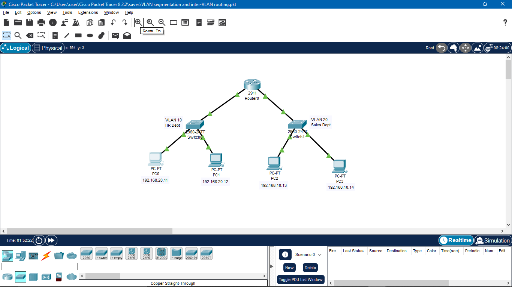

# 🔹 VLAN Segmentation and Inter-VLAN Routing (Cisco Packet Tracer)


## 📌 Project Overview
This project demonstrates VLAN segmentation and inter-VLAN routing in a simulated enterprise network using **Cisco Packet Tracer**. The network is designed to separate departments into different VLANs while allowing controlled communication between them through a router.

The lab highlights best practices in **Layer 2 segmentation**, **Layer 3 routing**, and basic **enterprise LAN design**.

## 🎯 Objectives
* Implement VLAN-based network segmentation for multiple departments.
* Configure access ports and assign VLANs on Cisco switches.
* Enable inter-VLAN communication using a router.
* Verify connectivity between hosts across different VLANs.
* Reinforce practical understanding of VLANs, routing, and subnetting.

## 🖧 Network Topology
The topology consists of:
* **1 Router (Cisco 2911):** Configured for inter-VLAN routing.
* **2 Layer 2 Switches (Cisco 2960):** Handling VLAN traffic.
* **2 VLANs:** Representing distinct departments.
    * VLAN 10 – HR Department
    * VLAN 20 – Sales Department
* **4 End Devices (PCs):** Connected to the respective switches.

### 📸 Topology Diagram
<p align="center">
  
</p>

> *Note: Ensure the image file is located in an `images` folder in your repository.*

## 🏷️ VLAN Design

| VLAN ID | VLAN Name | Department |
| :--- | :--- | :--- |
| **10** | HR_Department | Human Resources |
| **20** | Sales_Dept | Sales |

## 🌐 IP Addressing Scheme

### VLAN 10 – HR Department
| Device | IP Address |
| :--- | :--- |
| **PC0** | 192.168.29.11 |
| **PC1** | 192.168.20.12 |

### VLAN 20 – Sales Department
| Device | IP Address |
| :--- | :--- |
| **PC2** | 192.168.10.13 |
| **PC3** | 192.168.10.14 |

## 🧠 Skills Demonstrated
* ✅ **VLAN Creation & Management:** Configuring VLAN databases on switches.
* ✅ **Access Port Configuration:** Assigning switch ports to specific VLANs.
* ✅ **Inter-VLAN Routing:** Configuring Router-on-a-Stick (or physical interfaces) for routing between subnets.
* ✅ **IP Addressing:** Managing static IP allocation for end devices.
* ✅ **Network Design:** implementing Enterprise LAN principles.
* ✅ **Troubleshooting:** Verifying connectivity using Ping and Simulation mode.

---

## 🚀 How to Run
1.  **Clone the Repo:**
    ```bash
    git clone [https://github.com/your-username/your-repo-name.git](https://github.com/your-username/your-repo-name.git)
    ```
2.  **Open Packet Tracer:** Launch Cisco Packet Tracer (Version 8.0+ recommended).
3.  **Load File:** Open the `.pkt` project file included in this repository.
4.  **Test Connectivity:** Use the Command Prompt on PC0 to ping PC2 to verify Inter-VLAN routing.

## 👤 Author
**[Your Name]**
